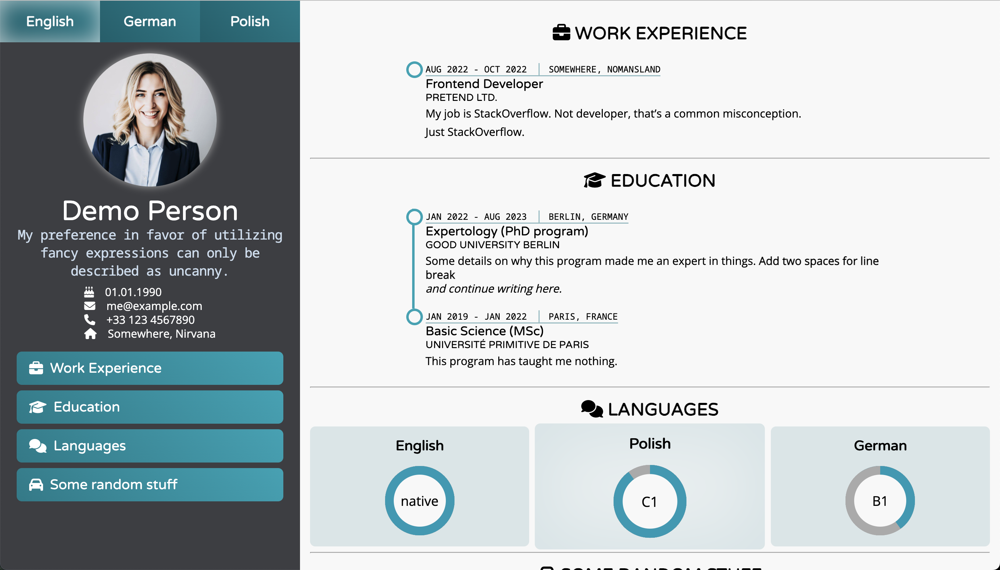
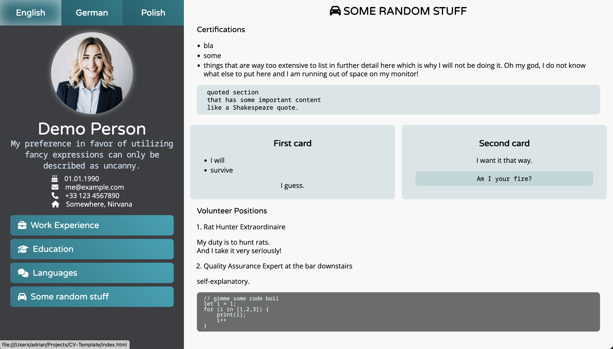
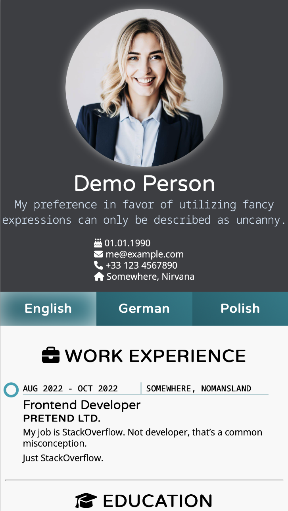
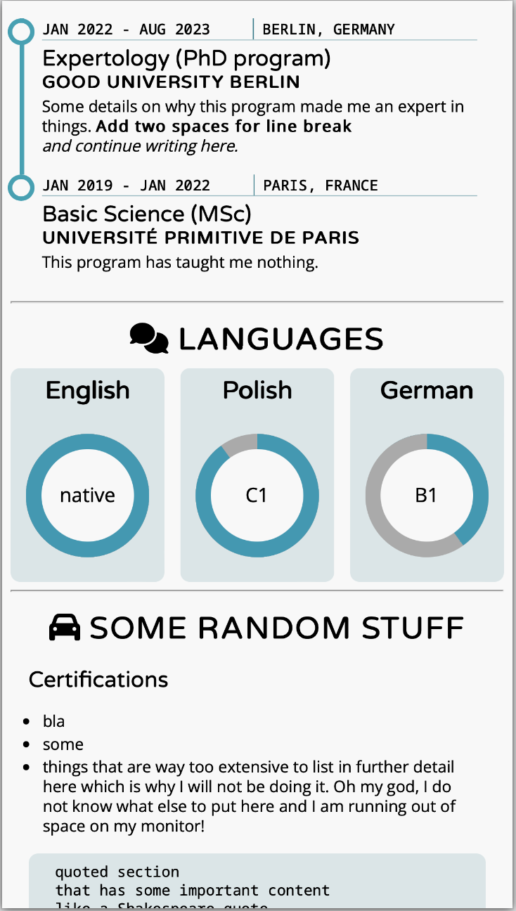

# CV-Template
Build a responsive and printable resume webpage from a structured markdown file. Screenshots [here](#screenshots).

## How to

### 1. Fill in your resumé information in markdown format

An example can be found in _YourResume.md_.

Some elements are needed to convert the information to the proper structure. 

- Empty lines are needed to separate elements
- Dashes `-` and numbers `1.` start a list
- Hash tags `#` indicate a heading (one # for first level, two ## for second level etc.)
- Curly braces `{}` assign attributes to headings, e.g. `{.cards}`
  - Some headings `#` contain `.fa .fa-something` in `{}`. This assigns an icon to the heading. Icons can be found [here](https://fontawesome.com/search).
  - Skills `{.skills}` sections contain a list `-` with the text in the skill circle and a percentage to fill it by.
  - Cards `{.cards}` sections can contain virtually any content.
  - Timelines `{.timeline}` accept a table with info to display above an entry – the header will be displayed, the body will be hidden.
- Tables are written as:

```
| Col 1 | Col 2 |
| ----- | ----- |
| cont- | -ent  |
```

Therefore timeline information is entered as:

```
| Date | Location |
|-|-|
```

### 2. Run the following command:
```
pandoc -s --toc --toc-depth 1 -t html5 --template assets/template.html -o index.html YourResume.md
```

## Multi-lingual support
Repeat the above steps for each language, while linking the remaining languages at the top of each file in the `{.lang}` section.

## That should be it! ✅

# Screenshots

## Desktop: 




## Mobile:


