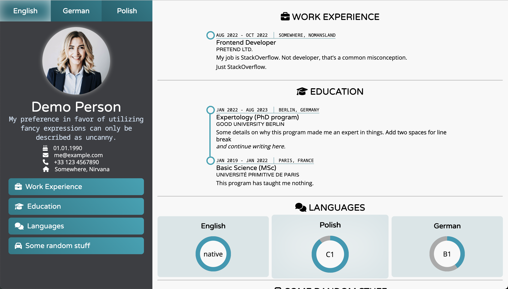
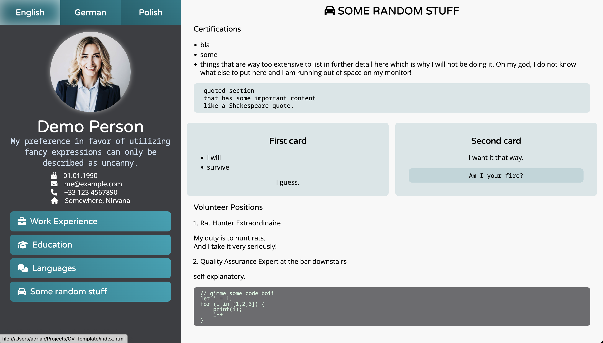

# CV-Template

This repo now centers on two things:

- the local `anschmiegcv` RenderCV theme
- a very small `cv` CLI wrapper that detects split YAML inputs and forwards them to RenderCV

For a practical walkthrough of the wrapper and theme customizations, see `/Users/adrian/Projects/CV-Template/docs/USER_GUIDE.md:1`.

## Layout

- `anschmiegcv/`: the RenderCV theme package and Typst templates
- `cv/`: the tiny helper CLI and modules for `merge`, `render`, split-file discovery, and font caching
- `example_data.yaml`: sample CV data, plus `settings` and optional `locale`
- `example_design.yaml`: sample `design` overlay

## Usage

Install the project in editable mode, or run it from this repo with `uv`.

## Starting a new CV repo

For a real personal CV, keep the CV content in its own private repository and
bring this theme in next to the YAML input. RenderCV expects a local custom
theme folder named exactly `anschmiegcv` beside the source YAML, so the target
layout should look like this:

```text
my-cv/
  my_data.yaml
  my_design.yaml
  profile_picture.jpg
  anschmiegcv/
  rendercv_output/
```

### Recommended: pinned theme submodule

A Git submodule gives you a reproducible theme version. It does not auto-sync on
every upstream change, which is usually a good thing for a CV: you decide when
to update the theme and can review the rendered output before committing.

```bash
mkdir my-cv
cd my-cv
git init

git submodule add https://github.com/anschmieg/CV-Template.git .theme/CV-Template
ln -s .theme/CV-Template/anschmiegcv anschmiegcv
cp .theme/CV-Template/example_data.yaml my_data.yaml
cp .theme/CV-Template/example_design.yaml my_design.yaml
cp .theme/CV-Template/profile_picture.jpg profile_picture.jpg

cat > .gitignore <<'EOF'
rendercv_output/
fonts/
*.rendercv.yaml
EOF

git add .gitignore .gitmodules .theme/CV-Template anschmiegcv my_data.yaml my_design.yaml profile_picture.jpg
git commit -m "chore: initialize CV"
```

Render with the helper from the theme repo:

```bash
uv run --project .theme/CV-Template cv my_data.yaml
```

Update the theme deliberately:

```bash
git submodule update --remote .theme/CV-Template
uv run --project .theme/CV-Template cv my_data.yaml
git add .theme/CV-Template
git commit -m "chore: update CV theme"
```

When cloning this CV repo elsewhere, include submodules:

```bash
git clone --recurse-submodules <your-cv-repo-url>
```

Or, after a normal clone:

```bash
git submodule update --init --recursive
```

### Local auto-sync while developing the theme

If you are actively editing this theme and want a CV repo to reflect local theme
changes immediately, use a symlink to your local checkout instead of a submodule:

```bash
mkdir my-cv
cd my-cv
git init

ln -s /Users/adrian/Projects/CV-Template/anschmiegcv anschmiegcv
cp /Users/adrian/Projects/CV-Template/example_data.yaml my_data.yaml
cp /Users/adrian/Projects/CV-Template/example_design.yaml my_design.yaml
cp /Users/adrian/Projects/CV-Template/profile_picture.jpg profile_picture.jpg
```

Then render with:

```bash
uv run --project /Users/adrian/Projects/CV-Template cv my_data.yaml
```

This is convenient on one machine, but it is less portable than a submodule.
Use it for iteration; use the submodule form when the CV repo should stand on
its own.

### Recommended naming

- `*_data.yaml`: main RenderCV input containing `cv`, plus optional `settings` and `locale`
- `*_design.yaml`: companion file containing only the top-level `design:` block

This avoids colliding with RenderCV’s common merged-file naming like `Name_CV.yaml`.

### Render split inputs automatically

```bash
uv run cv example_data.yaml
```

If `example_design.yaml` exists next to it, the wrapper calls RenderCV with the native `--design` overlay.

Before rendering, the wrapper also runs in a default “convenient font mode”:

- HTML keeps using Google Fonts directly
- PDF/PNG caches the configured Google font families into a local `fonts/` folder next to the input YAML if they are not present yet
- if a Google font download fails, rendering still continues and Typst falls back to other available fonts

If there is exactly one `*_data.yaml` in the current directory, you can omit the filename:

```bash
uv run cv
```

If multiple data files exist but only one is not a sample file like `example_data.yaml`, `sample_data.yaml`, or `demo_data.yaml`, the wrapper picks that non-sample file automatically.

Any extra arguments are forwarded to native RenderCV, for example:

```bash
uv run cv example_data.yaml --pdf-path output/custom.pdf
```

You can also point the command at either companion file:

```bash
uv run cv example_design.yaml
```

The explicit subcommand remains available:

```bash
uv run cv render example_data.yaml
```

### Render without `uv`

There is also a tiny repo-local runner:

```bash
./render
```

Or, if you prefer invoking Python directly:

```bash
python render
```

It prefers the project `.venv` when present, and otherwise falls back to the current Python.

### Merge split inputs into one file

```bash
uv run cv merge example_data.yaml
```

That writes `example.rendercv.yaml` by default.

For compatibility, `uv run anschmiegcv ...` still works too.

## Theme notes

- `cv` is the preferred helper command, while `anschmiegcv` is the RenderCV theme name and package.
- PDF and HTML now share the same fallback semantics: when a template span does not specify a class like `.color-headline` or `.w600`, custom entry rendering falls back to RenderCV-native design tokens from `design.colors`, `design.typography`, `design.entries`, and `design.sections` rather than separate hardcoded theme values.
- Section title directives like `{.cards}` and `{.timeline}` are handled by the theme templates.
- Theme-specific colors `timeline_dot` and `timeline_line` are supported through `anschmiegcv`.
- `design.colors` supports two modes:
  - explicit RenderCV-native element colors such as `body`, `headline`, `section_titles`, `timeline_dot`, and `timeline_line`
  - optional palette generation via `accent` and optional `base`, which fills any missing RenderCV-native color tokens while still letting explicit per-element colors override the generated values
- Entry templates now drive both PDF and HTML consistently.
- The wrapper defaults to a convenient font workflow:
  - web output loads the configured `design.typography.font_family.*` values from Google Fonts
  - PDF/PNG output uses the same family names, but caches the corresponding `.ttf` files into a local `fonts/` directory for Typst instead of relying on system Font Book resolution
  - the cache lives next to the input YAML and is ignored by Git
- HTML timeline geometry is derived from the same design values mathematically, using exact `calc()` relationships rather than visual nudges.
- Markdown in template lines is respected in both outputs, for example:

  ```yaml
  design:
    templates:
      education_entry:
        main_column: |
          **AREA**, DEGREE
          INSTITUTION
          HIGHLIGHTS
  ```

- Preferred styling syntax is Pandoc-style spans with classes:

  ```yaml
  design:
    templates:
      education_entry:
        main_column: |
          [AREA]{.color-section_titles .semibold}, [DEGREE]{.color-black .regular}
          [INSTITUTION]{.color-headline .italic}
          HIGHLIGHTS
  ```

- Supported span classes include:
  - `.color-headline`, `.color-section_titles`, `.color-footer`, etc. for any key in `design.colors`
  - `.color-red`, `.color-black`, or other literal color names if they are valid in HTML/Typst
  - `.weight-400`, `.weight-500`, `.weight-600`, `.weight-700`
  - shorthand `.w400`, `.w500`, `.w600`, `.w700`
  - built-ins like `.regular`, `.medium`, `.semibold`, `.bold`, `.italic`, and `.underline`
- Classes can be combined on one span, and mid-line styling works naturally:

  ```yaml
  main_column: |
    [AREA]{.color-section_titles .w600}, [DEGREE]{.color-black .weight-400}
  ```

- Legacy `{color:...}` inline directives still work, but span classes are the recommended syntax going forward.

### Color configuration modes

You can either set every RenderCV color token directly:

```yaml
design:
  colors:
    body: rgb(25, 48, 51)
    name: rgb(0, 120, 135)
    headline: rgb(3, 103, 116)
    section_titles: rgb(0, 50, 108)
    timeline_dot: rgb(0, 50, 108)
    timeline_line: rgb(0, 50, 108)
```

Or you can provide a palette seed and let `anschmiegcv` derive any missing tokens:

```yaml
design:
  colors:
    accent: "#007887"
    base: "#222222"
```

In palette mode:

- `accent` drives the heading, link, and timeline family
- `base` drives the body / neutral family
- any explicitly provided RenderCV-native token still wins over the generated palette
- PDF and HTML both consume the resolved `design.colors.*` values, so they stay in sync

## Screenshots



